# Block 0 — Welcome {.section}

## Reinforcement Learning in 3 hours

By the end of today you will be able to:

- Read the **SARSA** algorithm
- Explain every line of the pseudocode
- Run SARSA by hand on a 4-state MDP
- Say what SARSA converges to and *why*

::: notes
Title slide. Greet, take attendance, name the single learning outcome out loud:
"By the end of today you can read SARSA pseudocode, explain every line, run it
by hand on a 4-state MDP, and say what it's converging to and why."
:::

## Roadmap

**Block 1** &nbsp;—&nbsp; Markov Decision Processes &nbsp;·&nbsp; **45 min**

&nbsp;&nbsp;&nbsp;&nbsp;☕ &nbsp;break &nbsp;·&nbsp; 10 min

**Block 2** &nbsp;—&nbsp; Returns, value functions, Bellman equations &nbsp;·&nbsp; **50 min**

&nbsp;&nbsp;&nbsp;&nbsp;☕ &nbsp;break &nbsp;·&nbsp; 10 min

**Block 3** &nbsp;—&nbsp; $\varepsilon$-greedy, SARSA, Q-learning teaser &nbsp;·&nbsp; **50 min**

**Block 4** &nbsp;—&nbsp; Wrap-up &nbsp;·&nbsp; **10 min**

::: notes
Three blocks: (1) MDPs, (2) value functions and Bellman, (3) SARSA + a 5-min
Q-learning teaser. Two breaks. Three short pair-exercises. End with Cliff
Walking comparison.
:::

# Block 1 — Markov Decision Processes {.section}

## Hook: a warehouse delivery robot

:::: {.columns}
::: {.column width="55%"}
- $4 \times 4$ grid warehouse
- Pick up the **package** at one cell
- Deliver to the **depot** at another
- The floor is **slippery** — the intended move only happens 80 % of the time
- Each step **costs battery**; running out ends the episode

. . .

**The question.** What is the best plan? And how could the robot *learn* one without being told the rules?
:::

::: {.column width="45%"}
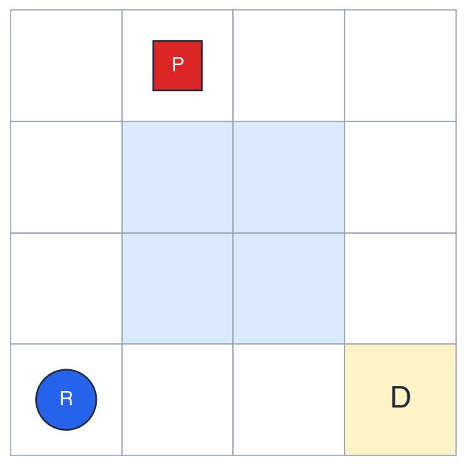{width="100%"}
:::
::::

::: notes
4×4 grid. Robot picks up package, delivers to depot. Stochastic floor (slip),
finite battery. This is our running example for ALL of today.
Figure: gridworld render with robot, package, depot, slippery cells.
:::

## What makes sequential decisions under uncertainty hard?

::: {.fragment}
1. Decisions affect **future states**, not just the immediate outcome.
:::

::: {.fragment}
2. Outcomes are **random**.
:::

::: {.fragment}
3. Reward is **delayed** — the depot is many steps away.
:::

. . .

We need a formalism that captures all three. Enter the **Markov Decision Process**.

::: notes
Decisions affect future states. State is partially random. Reward is delayed.
We need a formalism that captures all three.
:::

## The Markov property

**Intuition.** The current state is a *sufficient statistic* of the past — given $S_t$, knowing $S_{t-1}, S_{t-2}, \dots$ adds nothing.

**Formally:**
$$
\begin{aligned}
&\Pr\!\left[\,S_{t+1} = s' \,\big|\, S_0, A_0, \dots, S_t = s, A_t = a\,\right] \\[2pt]
&\qquad\qquad =\; \Pr\!\left[\,S_{t+1} = s' \,\big|\, S_t = s, A_t = a\,\right]
\end{aligned}
$$

::: {.fragment .callout-tip title="Sticky point"}
A restriction on the **state**, not on the process. If you need the past, fold it into the state.
:::

::: notes
Intuition first ("the state contains everything you need"), then formal.
Pre-empt: "this is a restriction on the STATE, not on the process" (S&B §3.1).
Example: in the warehouse, position alone is NOT Markov (we also need
"holding-package?" and battery level). Once you include them, it is.
:::

## Notation we will use today

:::: {.columns}
::: {.column width="50%"}
**Random variables, realizations**

| Symbol            | Meaning                                  |
|-------------------|------------------------------------------|
| $S_t,\ A_t$       | random state and action at step $t$      |
| $R_{t+1}$         | random reward after $A_t$ in $S_t$       |
| $s,\ a,\ r$       | realizations / dummy variables           |
:::

::: {.column width="50%"}
**Value functions, hyperparameters**

| Symbol            | Meaning                                  |
|-------------------|------------------------------------------|
| $v_\pi,\ q_\pi$   | **true** value functions under $\pi$     |
| $V,\ Q$           | **estimates** (what algorithms update)   |
| $\pi$             | policy                                   |
| $\gamma,\,\alpha,\,\varepsilon$ | discount, step size, exploration |
:::
::::

::: {.callout-tip title="Sticky point"}
Reward is indexed $t+1$, not $t$. Standard Sutton & Barto convention.
:::

::: notes
Lock the conventions early — return to this slide if students get confused.
- The v vs V distinction is load-bearing later: SARSA's whole story is
  "Q (estimate) approaches q_π (truth)."
- R_{t+1} convention emphasises that the reward is jointly determined with
  the next state.
:::

## An MDP is a 5-tuple $\langle \mathcal{S}, \mathcal{A}, P, R, \gamma \rangle$

:::: {.columns}
::: {.column width="55%"}
| Symbol         | Name                  | Type                                                                  |
|----------------|-----------------------|-----------------------------------------------------------------------|
| $\mathcal{S}$  | state space           | a set                                                                 |
| $\mathcal{A}$  | action space          | a set                                                                 |
| $P$            | transition kernel     | $\mathcal{S} \times \mathcal{A} \to \Delta(\mathcal{S})$              |
| $R$            | reward function       | $\mathcal{S} \times \mathcal{A} \times \mathcal{S} \to \mathbb{R}$    |
| $\gamma$       | discount factor       | scalar in $[0, 1]$                                                    |
:::

::: {.column width="45%"}
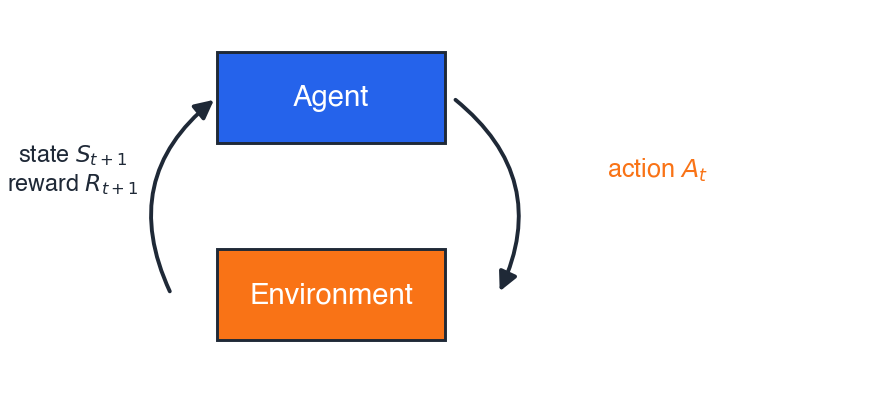{width="100%"}

\begin{center}\small Agent–environment interface\end{center}
:::
::::

::: notes
One slide naming all five components. Detail per component on next 5 slides.
:::

## $\mathcal{S}$ — the state space

Everything the agent needs to know to act.

**Warehouse robot, partial list:**

- Position on grid: $(x, y) \in \{0,1,2,3\}^2$
- Holding the package? $\in \{0, 1\}$
- Battery level: $\in \{0, 1, \dots, B_{\max}\}$

Total: $|\mathcal{S}| = 16 \times 2 \times (B_{\max}+1)$.

::: {.fragment}
The state is whatever makes the **Markov property** hold for *your* problem.
:::

::: notes
Warehouse: position, has-package?, battery level. List ~8 example states.
Sanity-check the Markov property with the students: is just (x,y) Markov?
No — knowing whether you've already picked up the package matters.
:::

## $\mathcal{A}$ — the action space

What the agent can choose at each step.

**Warehouse robot:**

$$
\mathcal{A} = \{\,\text{N},\ \text{S},\ \text{E},\ \text{W},\ \text{pick-up},\ \text{drop}\,\}
$$

::: {.fragment}
Action availability can depend on the state — `pick-up` only makes sense on the package cell. We model this either by giving an action-set $\mathcal{A}(s)$ per state, or by allowing the action everywhere and giving illegal cases a large negative reward.
:::

::: notes
Warehouse: {N, S, E, W, pick-up, drop}. Note action availability can depend
on state.
:::

## $P$ — the transition kernel

:::: {.columns}
::: {.column width="55%"}
$$
P(s' \mid s, a) \;=\; \Pr\!\left[\,S_{t+1} = s' \,\big|\, S_t = s,\ A_t = a\,\right]
$$

A *probability distribution* over next states. Sums to $1$ over $s'$.

**Warehouse step (slippery floor):** intended N happens 80 %; left- and right-slips happen 10 % each.

::: {.fragment .callout-warning}
In the real world we **do not know** $P$. That is the whole reason today's lecture exists.
:::
:::

::: {.column width="45%"}
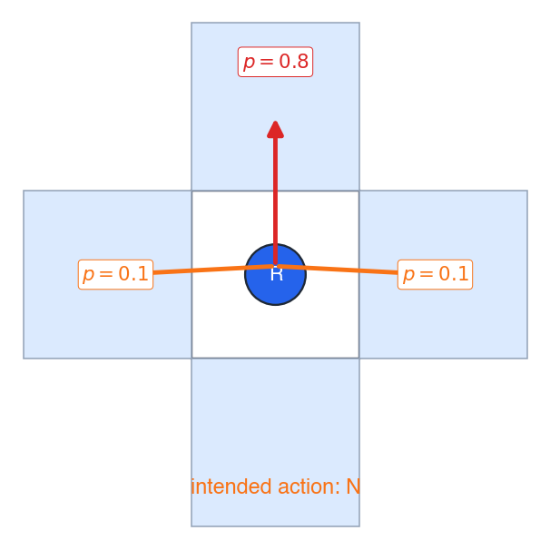{width="100%"}
:::
::::

::: notes
P(s' | s, a). Show stochastic warehouse step: 80% intended direction, 10%
left-slip, 10% right-slip. Walls = stay in place. This is the "kernel"
because we don't know it in real engineering problems.
:::

## $R$ — the reward function

$$
R(s, a, s') \;=\; \text{scalar reward observed when } s \xrightarrow{a} s'
$$

**Warehouse rewards:**

- $+10$ for delivering the package to the depot
- $-1$ per step (battery cost)
- $-100$ if the battery dies before delivery

::: {.fragment .callout-tip}
> The reward signal communicates **what** you want — not **how** you want it achieved.
> *Sutton & Barto §3.2*
:::

::: {.fragment}
Sub-rewards like *"+1 for moving north"* often teach the agent the **wrong** skill.
:::

::: notes
R(s, a, s'). Warehouse: +10 for delivery, -1 per step, -100 for battery death.
The reward-design pitfall is the most common engineering trap. The classic
example: a chess-playing agent rewarded for capturing pieces will sacrifice
checkmate for material.
:::

## $\gamma$ — the discount factor

$\gamma \in [0,\ 1]$ — future rewards are *discounted* by $\gamma$ per step. Battery **now** $>$ battery in five steps; keeps infinite-horizon sums **finite**.

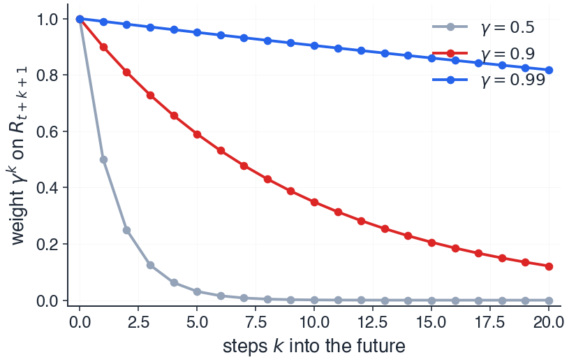{width="65%" fig-align="center"}

::: {.callout-warning title="Pre-empt"}
A *large* $\gamma$ does **not** mean short-term focus — $\gamma$ close to $1$ makes the agent **patient**.
:::

::: notes
γ ∈ [0, 1]. Engineering intuition: cash now > cash later, battery now > battery
later, sensor reading now > sensor reading later. Pre-empt: large γ does NOT
mean short-term focus (CS234 misconception poll).
:::

## Trajectories and episodes

A **trajectory** is the sequence the MDP generates:

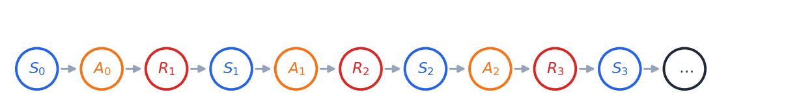{width="95%" fig-align="center"}

An **episode** is a trajectory that ends in a *terminal* state.

**Warehouse:** an episode ends when the package is delivered, or the battery dies.

::: notes
S_0, A_0, R_1, S_1, A_1, R_2, ... Episode = trajectory ending in terminal state.
Warehouse: episode ends when package delivered or battery dies.
Note again: reward at index t+1 is the consequence of acting at time t.
:::

## Policies: deterministic and stochastic

**Stochastic:** $\pi(a \mid s) = \Pr[A_t = a \mid S_t = s]$ &nbsp;·&nbsp; **Deterministic:** $\pi(s) = a$

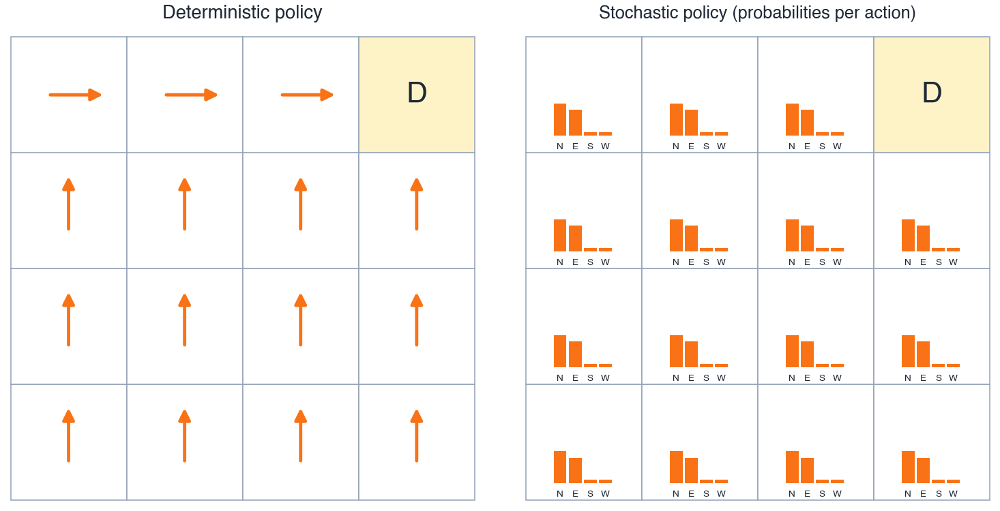{width="92%" fig-align="center"}

::: {.fragment}
We will see soon why we sometimes *want* stochastic policies — to **explore**.
:::

::: notes
π(a|s) for stochastic; π(s) → a for deterministic. Warehouse example of each.
Why we sometimes want stochastic policies: exploration (foreshadowing ε-greedy).
:::

## Exercise 1 — identify the MDP components

::: {.callout-note title="Pair work — 3 min"}
A battery-powered shuttle moves along a one-way 3-stop bus route. At each stop it can `wait` (passengers may board) or `depart`. Each passenger carried gives reward $+5$; each minute waiting costs $-1$; arriving at the depot ends the episode.

1. Write down $\mathcal{S}$ and $\mathcal{A}$.
2. Sketch one valid trajectory of length $4$.
3. Write one deterministic policy.
:::

::: notes
Pair exercise (3 min). Solution on the next slide — reveal on click.
The "trick": students must include passenger count and time in the state to
make the dynamics Markov. Many will write S = {0, 1, 2} (just the stop).
That's the teachable moment.
:::

## Exercise 1 — solution

::: {.fragment}
**$\mathcal{S}$:** $(\text{stop} \in \{0,1,2\},\ \text{passengers} \in \mathbb{N}_0,\ \text{minute} \in \mathbb{N}_0)$ — the state must contain enough to decide.
:::

::: {.fragment}
**$\mathcal{A}$:** $\{\text{wait},\ \text{depart}\}$.
:::

::: {.fragment}
**Trajectory** *(one example)*:
$(0, 0, 0) \xrightarrow{\text{wait}}_{R=-1} (0, 1, 1) \xrightarrow{\text{depart}}_{R=+5} (1, 0, 2) \xrightarrow{\text{wait}}_{R=-1} (1, 1, 3)$
:::

::: {.fragment}
**Deterministic policy:** *"depart whenever passenger count $\geq 1$; otherwise wait."*
:::

::: {.fragment .callout-warning}
**Common error.** Confusing the **trajectory** (what happened) with the **policy** (the decision rule that produced it).
:::

::: notes
Walk through. Most common error: confusing trajectory with policy.
Second common error: writing S = {stop} only — not Markov.
Third common error: putting reward in the action ("depart, +5"). Reward
is determined by the environment after the action, not chosen by the agent.
:::

# ☕ Break (10 min) {.section}

# Block 2 — Returns, value functions, Bellman {.section}

## The return $G_t$

The **undiscounted** return:
$$
G_t \;=\; R_{t+1} + R_{t+2} + R_{t+3} + \dots
$$

::: {.fragment}
Two problems:

- May be **infinite** if the episode never ends.
- Treats reward today and reward in 1 000 steps the same.
:::

::: {.fragment}
The **discounted** return:
$$
G_t \;=\; R_{t+1} + \gamma R_{t+2} + \gamma^2 R_{t+3} + \dots \;=\; \sum_{k=0}^{\infty} \gamma^k R_{t+k+1}
$$

For $\gamma < 1$ and bounded rewards, the sum is **always finite**.
:::

::: notes
G_t = R_{t+1} + γ R_{t+2} + γ² R_{t+3} + ... = Σ γ^k R_{t+k+1}.
Undiscounted version first (γ=1), then motivate γ < 1: bounded sums for
infinite-horizon, time-cost-of-money analogy for engineers.
:::

## Why expectations?

The return $G_t$ is **random**:

- Stochastic environment ($P$)
- Stochastic policy ($\pi$)

::: {.fragment}
Two trajectories from the same starting state can give wildly different $G_t$. We need a *single number* per state to compare policies.
:::

::: {.fragment}
**Solution.** Take the expected value:
$$
\text{value} \;:=\; \mathbb{E}_\pi[\,G_t \mid \text{starting situation}\,]
$$

The subscript $\pi$ means: "expectation over trajectories generated by following policy $\pi$."
:::

::: notes
Returns are RANDOM (stochastic policy + stochastic transitions). To compare
policies we compare expected returns. Quick refresher on E[·] notation —
engineering students may need it. Mention: linearity, tower property — we'll
use both in the Bellman derivation.
:::

## State-value $v_\pi(s)$

The expected return *if you start in $s$ and follow $\pi$ forever after*:

$$
\boxed{\;v_\pi(s) \;:=\; \mathbb{E}_\pi[\,G_t \mid S_t = s\,]\;}
$$

::: {.fragment}
**Warehouse:** "Value of being in this cell, given my current policy."
:::

::: {.fragment .callout-tip title="Sticky"}
Lowercase $v_\pi$ = the **true** function (a property of the MDP and $\pi$).
Uppercase $V$ = our **estimate** (what algorithms compute).
:::

::: notes
v_π(s) = E_π[G_t | S_t = s]. "Expected return if you start in s and act
according to π forever after." Warehouse interpretation: "value of being in
this cell, given my current policy."
Reinforce v vs V — this distinction is load-bearing for SARSA's whole story.
:::

## Action-value $q_\pi(s, a)$

The expected return *if you start in $s$, take action $a$, and follow $\pi$ forever after*:

$$
\boxed{\;q_\pi(s, a) \;:=\; \mathbb{E}_\pi[\,G_t \mid S_t = s,\ A_t = a\,]\;}
$$

::: {.fragment}
The first action is **overridden**; everything after that follows $\pi$.
:::

::: {.fragment .callout-important}
$q_\pi$ is the **protagonist** of the rest of the lecture. SARSA estimates $Q \approx q_\pi$.
:::

::: notes
q_π(s, a) = E_π[G_t | S_t = s, A_t = a]. "Expected return if you start in s,
take a, and act according to π forever after." This is the protagonist —
SARSA learns Q ≈ q_π. We'll see WHY q is more useful than v in a few slides
("greedy over q is model-free").
:::

## $v_\pi$ and $q_\pi$ are connected

The two are linked through the policy:

$$
\boxed{\;v_\pi(s) \;=\; \sum_a \pi(a \mid s)\, q_\pi(s, a)\;}
$$

::: {.fragment}
**In words.** The value of a state under $\pi$ is the policy-weighted average of its action-values at that state.
:::

::: {.fragment}
A consequence: if you have $q_\pi$, you have $v_\pi$ for free.
:::

::: notes
v_π(s) = Σ_a π(a|s) q_π(s, a).
Boxed slide. Foreshadow: "we'll see why q_π is the more useful object soon."
The reverse direction — getting q_π from v_π — needs the model P, R. That
asymmetry is the slide-26 punchline.
:::

## Bellman expectation: derivation, step 1

Start from the recursive form of the return:
$$
G_t \;=\; R_{t+1} + \gamma\, G_{t+1}
$$

::: {.fragment}
Plug into the definition of $v_\pi$:
$$
v_\pi(s) \;=\; \mathbb{E}_\pi[\,R_{t+1} + \gamma\, G_{t+1} \mid S_t = s\,]
$$
:::

::: {.fragment}
Linearity of expectation:
$$
v_\pi(s) \;=\; \mathbb{E}_\pi[R_{t+1} \mid S_t = s] \;+\; \gamma\, \mathbb{E}_\pi[G_{t+1} \mid S_t = s]
$$
:::

::: notes
Start from G_t = R_{t+1} + γ G_{t+1}. Plug into definition of v_π. Apply
linearity of expectation. Two terms to handle: immediate reward and
discounted future return. Each is handled on the next slide.
:::

## Bellman expectation: derivation, step 2

Condition on the action and the next state. By the **Markov property**, $\mathbb{E}_\pi[G_{t+1} \mid S_{t+1} = s']$ is just $v_\pi(s')$:

$$
\mathbb{E}_\pi[G_{t+1} \mid S_t = s] \;=\; \sum_a \pi(a \mid s) \sum_{s'} P(s' \mid s, a)\, v_\pi(s')
$$

::: {.fragment}
Same conditioning for the immediate reward:
$$
\mathbb{E}_\pi[R_{t+1} \mid S_t = s] \;=\; \sum_a \pi(a \mid s) \sum_{s'} P(s' \mid s, a)\, R(s, a, s')
$$
:::

::: {.fragment}
Combine — and we get the equation on the next slide.
:::

::: notes
Apply tower rule + Markov property. The Markov property is what lets us
collapse E[G_{t+1} | S_t, A_t, S_{t+1}] down to v_π(S_{t+1}).
This is the only place in the lecture where the Markov property does real work
in a derivation.
:::

## Bellman expectation equation for $v_\pi$  ★

:::: {.columns}
::: {.column width="65%"}
$$
\boxed{\;{\color{#2563eb}v_\pi(s)} \;=\; \sum_{\color{#f97316}a} {\color{#f97316}\pi(a \mid s)} \sum_{s'} P(s' \mid s, a) \Bigl[\, {\color{#dc2626}R(s,a,s')} + \gamma\, {\color{#2563eb}v_\pi(s')} \,\Bigr]\;}
$$

::: {.fragment}
**Reading.** Pick action under $\color{#f97316}\pi$ → observe $\color{#dc2626}r$ and next state $s'$ → value of $s$ is reward plus the discounted value at $s'$, **averaged over everything random**.
:::

::: {.fragment}
A **self-consistency** equation: $\color{#2563eb}v_\pi$ appears on both sides.
:::
:::

::: {.column width="35%"}
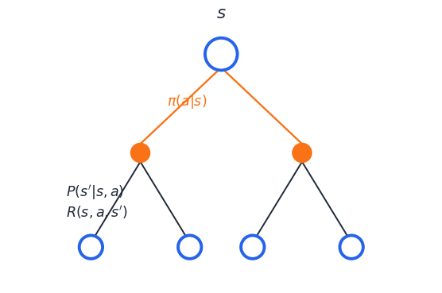{width="100%"}
:::
::::

::: notes
v_π(s) = Σ_a π(a|s) Σ_{s'} P(s'|s,a) [R(s,a,s') + γ v_π(s')].
This and the next slide are the most important slides of the lecture.
Take time. Annotate every term in colour: π(a|s) blue, P(s'|s,a) orange,
R green, γ v_π(s') purple.
"Self-consistency" — not a definition, not an equation to plug in, but a
constraint that v_π must satisfy.
:::

## Bellman expectation equation for $q_\pi$  ★★

:::: {.columns}
::: {.column width="65%"}
$$
\boxed{\;{\color{#2563eb}q_\pi(s, a)} \;=\; \sum_{s'} P(s' \mid s, a) \Bigl[\, {\color{#dc2626}R(s,a,s')} + \gamma\, \textstyle\sum_{\color{#f97316}a'} {\color{#f97316}\pi(a' \mid s')}\, {\color{#2563eb}q_\pi(s', a')} \,\Bigr]\;}
$$

::: {.fragment .callout-important title="THIS is the equation SARSA samples"}
The inner structure $\color{#dc2626}r + \gamma\, {\color{#2563eb}q_\pi(s', a')}$ for the next $(s', a')$ is **exactly** the $(S, {\color{#f97316}A}, {\color{#dc2626}R}, S', {\color{#f97316}A'})$ tuple SARSA collects.
:::
:::

::: {.column width="35%"}
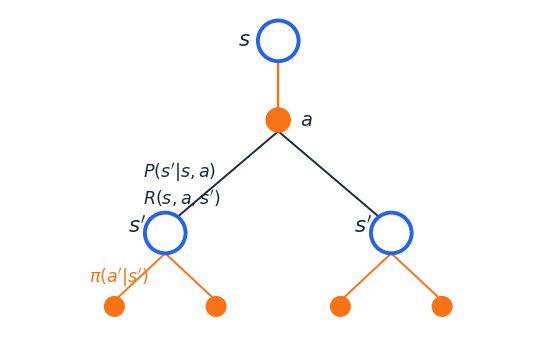{width="100%"}
:::
::::

::: notes
q_π(s,a) = Σ_{s'} P(s'|s,a) [R(s,a,s') + γ Σ_{a'} π(a'|s') q_π(s',a')].
THIS IS THE EQUATION SARSA SAMPLES. Highlight visually. Spend 4–5 minutes.
The annotation under the brace shows that the inner sum equals v_π(s'),
giving us a third form: q_π(s,a) = Σ P [R + γ v_π(s')]. Three equivalent
forms — all the same equation.
:::

## Worked example: compute $q_\pi$ by hand

3-state chain. Actions `left`, `right`. Deterministic transitions; step cost $-1$; entering terminal $T$ gives $+10$; $\gamma = 0.9$; policy $\pi$ = always `right`.

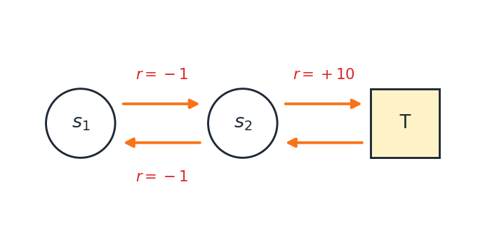{width="55%" fig-align="center"}

:::: {.columns}
::: {.column width="55%"}
**Bellman expectation chains back:**
$$
\begin{aligned}
q_\pi(s_2, \mathrm{right}) &= +10 \\
q_\pi(s_1, \mathrm{right}) &= -1 + \gamma\, q_\pi(s_2, \mathrm{right}) \\
q_\pi(s_2, \mathrm{left})  &= -1 + \gamma\, q_\pi(s_1, \mathrm{right})
\end{aligned}
$$
:::

::: {.column width="45%"}
::: {.fragment}
| $(s, a)$            | $q_\pi$ |
|---------------------|--------:|
| $(s_2, \mathrm{right})$ | $+10$ |
| $(s_1, \mathrm{right})$ | $+8$  |
| $(s_2, \mathrm{left})$  | $+6.2$ |

Only possible because we knew $P, R$.
:::
:::
::::

::: notes
Mini chain (CS234-style 3-state). Deterministic transitions to keep numbers
clean — students can verify by substitution. ~5 minutes on the board.
Punchline at the bottom: this whole exercise was possible BECAUSE we knew
P and R explicitly. In real problems, we don't.
:::

## Bellman backups in motion

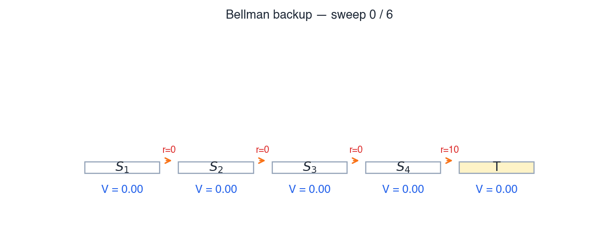{width="85%" fig-align="center"}

Each sweep propagates the +10 terminal reward one step backwards through the chain — exactly what the Bellman expectation equation prescribes.

::: notes
Animation: 5-state chain with reward +10 entering terminal T, γ=0.9.
Sweep through states right-to-left, applying V[i] ← R + γ V[i+1].
After 4 sweeps the values converge to V_target = 10·γ^(distance to terminal).
This is in-place value iteration — the simplest algorithmic embodiment of
the Bellman expectation equation. SARSA does the same thing but stochastically,
one sample at a time.
:::

## Bellman optimality — the dream

:::: {.columns}
::: {.column width="55%"}
The **optimal** value functions:
$$
v_*(s) = \max_\pi v_\pi(s),\quad q_*(s,a) = \max_\pi q_\pi(s, a)
$$

There is always a deterministic optimal policy $\pi_*$:
$$
q_*(s, a) = \sum_{s'} P(s'|s,a) \bigl[ R + \gamma \max_{a'} q_*(s', a') \bigr]
$$

Only difference vs. expectation: $\sum_{a'} \pi(a'|s') \to \max_{a'}$. The rest of the lecture **estimates $q_\pi$ for a gradually-improving policy**.
:::

::: {.column width="45%"}
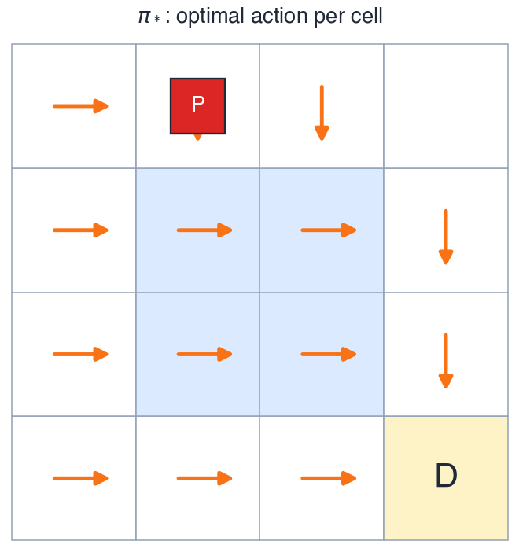{width="100%"}
:::
::::

::: notes
Name v* and q*. State the optimality equation. The MAX vs the sum-over-π is
the only structural difference. Don't dwell — Block 3 is about estimating
q_π for a slowly-improving policy, not about computing q_* directly.
The Q-learning teaser at the end of Block 3 will be the only time we
actually USE the max.
:::

## The catch: in practice, $P$ and $R$ are unknown

To solve the Bellman equations directly, we need $P$ and $R$ explicitly. **Real engineering problems** rarely give us either — slip probabilities, contact dynamics, transition kernels are all unknown or approximate.

::: {.fragment}
**Three families of solutions:**

1. **Estimate $P, R$ from data, then solve** *(Model-based RL — out of scope.)*
2. **Average lots of full episode returns** *(Monte Carlo — high variance, episodic only.)*
3. **Sample one transition and bootstrap** *(Temporal Difference — today.)* ★
:::

::: notes
Real warehouse: we don't know slip probabilities. Real robot: we don't have
the closed-form reward. Three options. We're going with #3 — sample +
bootstrap. The next slide locates all three on a 2x2.
:::

## Where TD sits — sample × bootstrap

:::: {.columns}
::: {.column width="50%"}
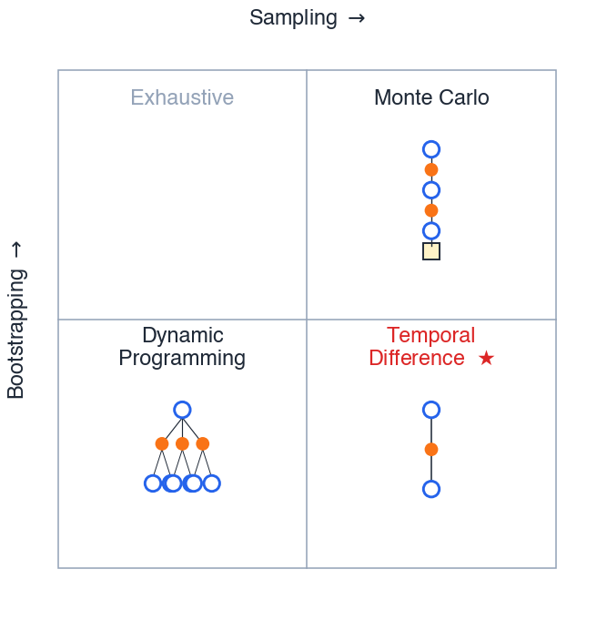{width="85%" fig-align="center"}
:::

::: {.column width="50%"}
- **DP.** Computes the expectation exactly — needs $P$ and $R$.
- **MC.** Samples whole episodes — no bootstrapping, but high variance.
- **TD.** Samples one transition, bootstraps off the current estimate.
- **SARSA lives in the TD corner.**
:::
::::

::: notes
CMU 2×2: rows = bootstrap?, columns = sample?
- DP: bootstrap, no-sample (needs full P, R)
- MC: sample, no-bootstrap (full episodes)
- TD: sample AND bootstrap ← SARSA lives here
- (empty corner: exhaustive search)
This is one of the cleanest single-slide expositions of where TD sits in
the algorithm landscape.
:::

## ★ Greedy improvement over $q_\pi$ is model-free

To act greedily, we need $\arg\max_a$.

:::: {.columns}
::: {.column width="50%"}
**With $V(s)$:**
$$
\arg\max_a \sum_{s'} P(s'|s, a) \bigl[\, R + \gamma V(s') \,\bigr]
$$
Needs $P, R$. **Model-based.**
:::

::: {.column width="50%"}
**With $Q(s, a)$:**
$$
\arg\max_a Q(s, a)
$$
Just look up the table. **Model-free.**
:::
::::

::: {.fragment .callout-important}
This is the reason SARSA estimates $q_\pi$ instead of $v_\pi$.
:::

::: notes
Silver L5 / van Hasselt. The bridge slide.
- arg max_a q_π(s, a) needs only the Q-table — model-free.
- arg max over v_π would need P to look ahead one step.
This is WHY we estimate q_π and not v_π. Land this hard.
Quote van Hasselt: "Greedy improvement over v requires a model;
greedy over q is model-free."
:::

## Exercise 2 — write a Bellman equation

::: {.callout-note title="Pair work — 3 min"}
The warehouse robot is in cell $(2, 1)$, holding the package, and considers action `N`.

The slip model is the standard $80/10/10$. Going `N`:

- Intended (80 %): land in $(2, 2)$
- Slip-left (10 %): land in $(1, 1)$
- Slip-right (10 %): land in $(3, 1)$

Each move costs $-1$. The policy $\pi$ is *"always go N until at the depot."*

**Write the Bellman expectation equation for $q_\pi\bigl((2,1,\text{has-pkg},\text{batt}=7),\, \mathrm{N}\bigr)$.**
:::

::: notes
Pair exercise (3 min). Goal: get students to mechanically apply the boxed
equation from slide 21. Watch for forgetting the π weighting on the
inner sum (since π here is deterministic, π(N|s')=1, so it disappears —
some students will write the inner sum AS A SUM and miss this).
:::

## Exercise 2 — solution

Apply the boxed Bellman equation. With $\pi$ deterministic ($\pi(s') = \mathrm{N}$ for every landing state) the inner sum collapses to a single term, and the step cost $-1$ factors out:

$$
q_\pi(s, \mathrm{N}) \;=\; -1 + \gamma \Bigl[\, 0.8\, q_\pi(s_N, \mathrm{N}) \,+\, 0.1\, q_\pi(s_W, \mathrm{N}) \,+\, 0.1\, q_\pi(s_E, \mathrm{N}) \,\Bigr]
$$

::: {.fragment .callout-warning title="Watch for"}
*(1)* Dropping the $\pi(a'|s')$ weighting (matters once $\pi$ is stochastic). *(2)* Double-counting the reward inside the inner sum. *(3)* Taking $\max_{a'}$ — that's Q-learning, not Bellman expectation for $q_\pi$.
:::

::: notes
Walk through. Two minutes. Then the punchline: this whole equation is
EXACTLY what SARSA will sample — except SARSA replaces the sums with one
observed transition and one observed action.
:::

# ☕ Break (10 min) {.section}

# Block 3 — ε-greedy and SARSA {.section}

## Driving home — a TD intuition pump

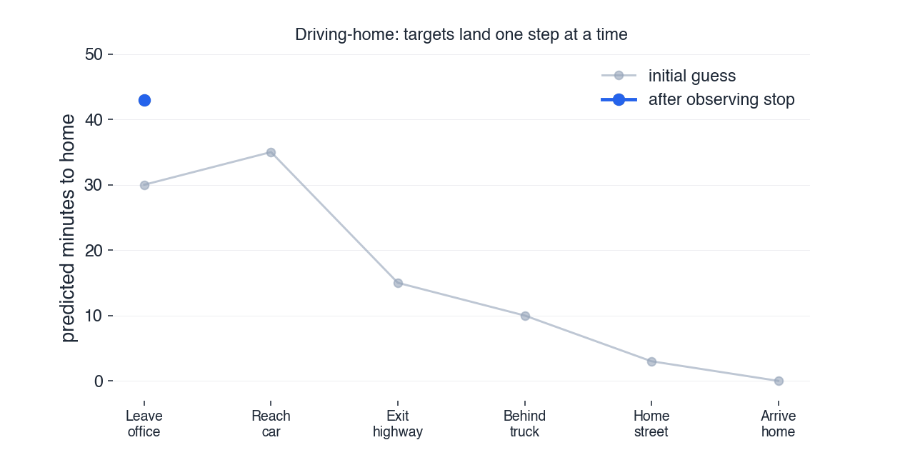{width="95%" fig-align="center"}

::: {.callout-important}
**MC** waits for the trip to end before correcting any estimate.
**TD** corrects each estimate the moment the *next* one moves.
That is **bootstrapping** — and you don't need an MDP to feel it.
:::

::: notes
S&B Ch 6 / Silver L4. The example everyone steals because it works.
Drive home: argue first that the rational thing is to update the office
estimate immediately using the better landmark-3 estimate. THEN say
"that's TD." No equations needed yet — pure intuition pump.
:::

## SARSA combines two ideas

To turn the Bellman expectation equation for $q_\pi$:

$$
q_\pi(s,a) \;=\; \sum_{s'} P(s'|s,a) \Bigl[ R(s,a,s') + \gamma \sum_{a'} \pi(a'|s')\, q_\pi(s', a') \Bigr]
$$

into something we can **learn from experience**, we make two substitutions.

::: {.fragment}
**Idea 1 — Sampling.** Replace the expectations $\sum_{s'} P,\ \sum_{a'} \pi$ by single observed samples.
:::

::: {.fragment}
**Idea 2 — Bootstrapping.** Replace the unknown $q_\pi(s', a')$ by our current **estimate** $Q(s', a')$.
:::

::: {.fragment}
The next two slides go deep on each idea.
:::

::: notes
Idea 1: SAMPLE the expectation in Bellman instead of computing it (we don't
know P). Idea 2: BOOTSTRAP — use the current Q-estimate of (s', a') instead
of waiting for the full return. The slide previews; the next two slides
expand each idea.
:::

## Idea 1 — Sampling

Bellman has $\sum_{s'} P(s'|s,a)\cdot[\dots]$ — an expectation we cannot compute (we don't know $P$).

::: {.fragment}
But the environment **hands us a sample** $s'$ every time we take action $a$ in state $s$.
:::

::: {.fragment}
**Trick.** Replace the expectation by **one** observed transition:
$$
\mathbb{E}[X] \;\approx\; X^{\,\text{(observed)}}
$$
:::

::: {.fragment}
Same idea applies to the inner $\sum_{a'} \pi(a'|s')$: just take **one** action $a'$ ourselves.
:::

::: notes
Bellman expectation for q_π has Σ_{s'} P(s'|s,a). We don't know P. But the
environment HANDS US a sample s' every time we take a in s. Replace the
expectation by one observed transition. Same for Σ_{a'} π(a'|s') — we
take one action a' ourselves (drawn from the policy). Two expectations,
two single-sample replacements.
:::

## Idea 2 — Bootstrapping

The Bellman expression contains $q_\pi(s', a')$ — a quantity we **don't know**.

::: {.fragment}
But we **have** an estimate $Q(s', a')$. Use it.
:::

::: {.fragment .callout-tip}
> **TD updates a guess towards a guess.**
> *— David Silver, UCL Lecture 4*
:::

::: {.fragment}
Yes, the target is a guess. Yes, it's biased. But it gets **better** as $Q$ improves — the algorithm bootstraps itself.
:::

::: notes
"TD updates a guess towards a guess." (Silver L4)
We don't know q_π(s', a'). We HAVE an estimate Q(s', a'). Use it. Yes, it's
a guess. Yes, it gets better as Q improves. This is the central RL trick.
Anticipate the obvious complaint: "but the target is wrong!" Yes — but it's
LESS wrong than starting from scratch every episode (Monte Carlo), and the
self-correction is what makes TD work.
:::

## The TD update for $Q$

Putting both ideas together:

$$
\boxed{\;{\color{#2563eb}Q(s, a)} \;\leftarrow\; {\color{#2563eb}Q(s, a)} \;+\; \alpha\, \Bigl[\, \underbrace{{\color{#dc2626}r} + \gamma\, {\color{#2563eb}Q(s', a')}}_{\text{TD target}} \;-\; \underbrace{{\color{#2563eb}Q(s, a)}}_{\text{current estimate}}\, \Bigr]\;}
$$

::: {.fragment}
The bracketed quantity is the **TD error**:
$$
\delta \;=\; \underbrace{{\color{#dc2626}r} + \gamma\, {\color{#2563eb}Q(s', a')}}_{\text{target}} \;-\; \underbrace{{\color{#2563eb}Q(s, a)}}_{\text{estimate}}
$$
:::

::: {.fragment}
**Reading.** Nudge the estimate $\color{#2563eb}Q(s, a)$ a fraction $\alpha$ of the way toward what Bellman would say *if we trusted our current estimates and one observed transition*.
:::

::: notes
Walk through term by term. Highlight in colour:
- (r + γ Q(s', a')) = TD target — Bellman's RHS with estimates plugged in
- Q(s, a) = current estimate
- Difference = TD error δ
- α = step size — how much we trust each observation
At α = 1 we replace; at α = 0 we don't learn. Robbins–Monro: shrink α.
:::

## Why we need exploration — the trap

Acting **greedily** with $Q \equiv 0$ initially. Ties broken by action order $\mathrm{N} \prec \mathrm{S} \prec \mathrm{E} \prec \mathrm{W}$.

::: {.fragment}
**Step 1.** All $Q$s tied at $0$ → robot picks $\mathrm{N}$ → step cost $-1$ → $Q(\text{start}, \mathrm{N}) = -0.5$.
:::

::: {.fragment}
**Step 2.** $Q(\text{start}, \mathrm{N}) = -0.5$ is now worst. Greedy picks the next-tied action $\mathrm{S}$ → after the update it too goes negative.
:::

::: {.fragment .callout-warning}
The robot **never tries** $\mathrm{E}$ or `pick-up` long enough to discover reward. $Q$ for those stays at $0$, so they "look good" forever — but never get a real chance.
:::

::: notes
Walk through carefully. Pure greedy + zero init is a soft trap; pure greedy
+ pessimistic init is a hard trap. Either way: greedy alone fails to
discover reward in the first place. Exploration is not optional.
:::

## Why we need exploration — the fix

The fix is to **occasionally pick a non-greedy action**.

::: {.fragment}
That is the role of $\varepsilon$-greedy on the next slide.
:::

::: notes
Bridge slide. One-line setup for ε-greedy. Keeps the trap-vs-fix
asymmetry clean for students.
:::

## $\varepsilon$-greedy

$$
A_t \;=\;
\begin{cases}
\arg\max_a Q(S_t, a) & \text{with prob.\ } 1 - \varepsilon \\
\text{uniform random} & \text{with prob.\ } \varepsilon
\end{cases}
$$

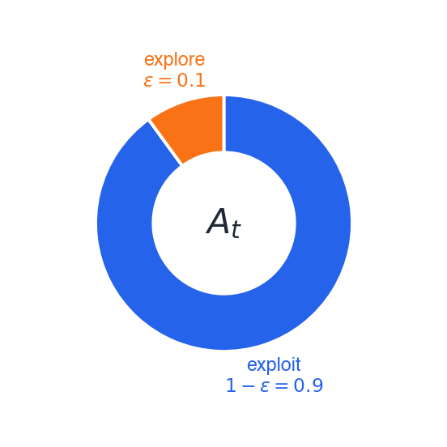{width="40%" fig-align="center"}

| $\varepsilon$ | behaviour                                  |
|---------------|--------------------------------------------|
| $0$           | pure exploit — catastrophe (last slide)    |
| $1$           | pure random walk — no learning             |
| $0.1$         | typical default                            |

::: notes
With probability 1−ε, take arg max_a Q(s,a). With probability ε, take a
uniformly random action. Two-doors example: open the right door 3 times
in a row, both times reward = 0. Are you SURE the left door isn't better?
You haven't tried it yet.
:::

## $\varepsilon$ schedules

:::: {.columns}
::: {.column width="50%"}
**Constant $\varepsilon$** — simple, but the policy stays *forever* stochastic and never reaches the optimum.

**Decaying $\varepsilon$** ($\varepsilon_t = 1/t$, exponential, …) — explore early, exploit late.

::: {.callout-note title="GLIE"}
*Greedy in the Limit with Infinite Exploration:* visit every $(s, a)$ infinitely often AND become greedy in the limit. The formal condition for SARSA to converge to the optimal policy.
:::
:::

::: {.column width="50%"}
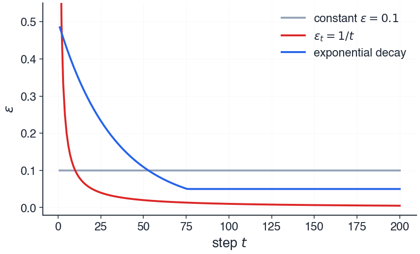{width="100%"}
:::
::::

::: notes
Constant ε vs decaying ε. Why decay: explore early when Q is bad,
exploit late when Q is good. GLIE = "Greedy in the Limit with Infinite
Exploration" — the formal condition for SARSA's policy convergence.
ε = 1/t is the simplest schedule that satisfies GLIE.
:::

## SARSA backup diagram

:::: {.columns}
::: {.column width="35%"}
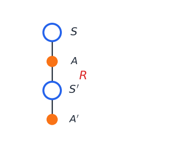{width="80%" fig-align="center"}
:::

::: {.column width="65%"}
- $A$ chosen $\varepsilon$-greedily from $Q(S, \cdot)$
- $R$, $S'$ observed from the environment
- $A'$ chosen $\varepsilon$-greedily from $Q(S', \cdot)$

::: {.fragment .callout-important}
The chain **is** the algorithm.
:::
:::
::::

::: notes
Vertical visual would be even better. The chain IS the algorithm.
Each arrow is one observation/decision step. The whole picture fits on
the slide and is the visual mnemonic for the name on the next slide.
:::

## Why "SARSA"?

The five elements of the chain:

$$
\Bigl( \;{\color{#2563eb}\mathbf{S}},\;\; {\color{#f97316}\mathbf{A}},\;\; {\color{#dc2626}\mathbf{R}},\;\; {\color{#2563eb}\mathbf{S}'},\;\; {\color{#f97316}\mathbf{A}'}\; \Bigr)
$$

::: {.fragment .callout-tip}
> *"This quintuple gives rise to the name **Sarsa** for the algorithm."*
> *— Sutton & Barto, §6.4*
:::

::: {.fragment}
The name IS the mnemonic.
:::

::: notes
S&B §6.4: "this quintuple gives rise to the name Sarsa for the algorithm."
The name IS the mnemonic. (S, A, R, S', A') = (state, action, reward,
next-state, next-action). Let students enjoy this; it's one of the
better-named algorithms in ML.
:::

## SARSA pseudocode — the whole algorithm

```
Initialize Q(s, a) arbitrarily for all s, a; set Q(terminal, ·) = 0
Choose hyperparameters α ∈ (0, 1], γ ∈ [0, 1], ε ∈ [0, 1]

Repeat (for each episode):
    S ← initial state of the episode
    A ← ε-greedy(Q, S)

    Repeat (for each step of episode):
        Take action A; observe R, S'
        A' ← ε-greedy(Q, S')
        Q(S, A) ← Q(S, A) + α [ R + γ Q(S', A') − Q(S, A) ]
        S ← S'
        A ← A'
    until S is terminal
```

::: {.fragment .callout-important}
Every symbol on this slide has appeared on a previous slide. We have arrived.
:::

::: notes
Walk through line by line. Take 5–6 minutes. For each line ask the class:
"Where have we seen this before?" Tie back to the agent–environment loop
(slide 4), the Bellman equation (slide 21), the TD update (slide 31),
ε-greedy (slide 33). This is the SOLO MILESTONE of the lecture — slow down.
:::

## Visualising $Q$ on the gridworld

Each cell is **quartered** — one triangle per action $\{N, S, E, W\}$. Number in each triangle = $Q(s, a)$.

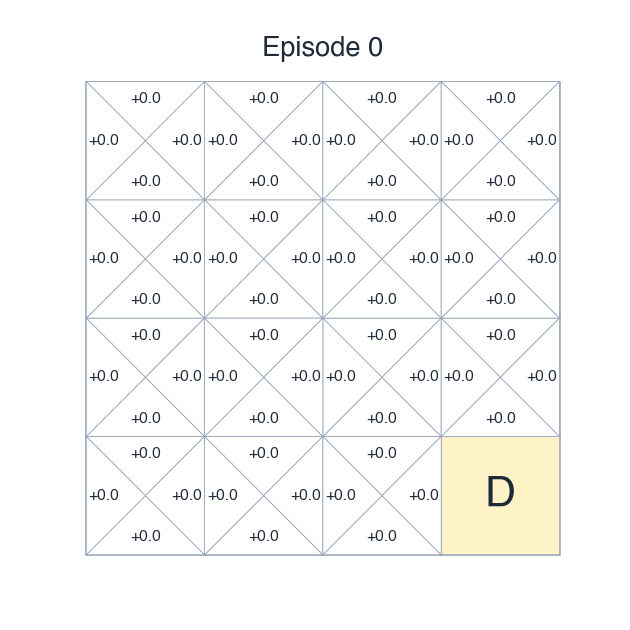{width="55%" fig-align="center"}

::: {.fragment}
Cells near the depot acquire high values first; value **flows backwards** from the depot through the gridworld.
:::

::: notes
CS188-style quartered-cell visualisation. Three snapshots show the
"value flowing backwards from the goal" intuition. If presenting live,
animate this with a slider over training episodes — much more memorable.
Figure file path: figures/q_gridworld_evolution.png.
:::

## Hand-trace SARSA — setup and first 2 steps

**Setup.** Robot at $(0, 0)$, no package, full battery. $Q \equiv 0$.
$\alpha = 0.5$, $\gamma = 0.9$, $\varepsilon = 0.1$.

::: {.fragment}
**Step 1.** $A = \mathrm{N}$ (greedy, tie-break order). Bumps wall: $S' = (0,0)$, $R = -1$. $A' = \mathrm{S}$ (next tie).
$$Q((0,0),\mathrm{N}) \;\leftarrow\; 0 + 0.5\,[-1 + 0.9 \cdot 0 - 0] \;=\; -0.5$$
:::

::: {.fragment}
**Step 2.** $A = \mathrm{S}$. Lands at $(0, 1)$, $R = -1$. $A' = \mathrm{N}$.
$$Q((0,0),\mathrm{S}) \;\leftarrow\; 0 + 0.5\,[-1 + 0.9 \cdot 0 - 0] \;=\; -0.5$$
:::

::: notes
Live on the board. Steps 1 and 2 walk the robot from (0,0) to (0,1).
Both updates are negative because Q ≡ 0 elsewhere and step cost is -1.
Continue on next slide.
:::

## Hand-trace SARSA — step 3 and the insight

::: {.fragment}
**Step 3.** Robot at $(0, 1)$. $A = \mathrm{N}$ (all $Q$s here still $0$). Lands at $(0, 0)$. $R = -1$. At $(0,0)$ now, $\mathrm{E}$ is the highest action ($\mathrm{N}, \mathrm{S}$ are at $-0.5$). $A' = \mathrm{E}$.
$$Q((0,1),\mathrm{N}) \;\leftarrow\; 0 + 0.5\,[-1 + 0.9 \cdot 0 - 0] \;=\; -0.5$$
:::

::: {.fragment .callout-note}
With $Q \equiv 0$ and step cost $-1$, **every** step makes the chosen action look worse — so greedy naturally keeps switching, even without $\varepsilon$. SARSA is *learning that nothing has worked yet*.
:::

::: notes
Punchline of the hand-trace: zero-init + negative step cost gives you a
form of "optimism in the face of uncertainty" almost for free. But this
trick alone breaks down once Q values stabilise. ε-greedy is the
permanent fix.
:::

## Convergence — the headline result

::: {.callout-tip title="Sutton & Barto, §6.4"}
> SARSA converges with probability 1 to an optimal policy and action-value function as long as **all state–action pairs are visited an infinite number of times** and the policy **converges in the limit to the greedy policy** (which can be arranged, for example, with $\varepsilon$-greedy policies by setting $\varepsilon = 1/t$).
:::

**Two conditions, no proof today:**

1. **GLIE.** Visit every $(s, a)$ infinitely often; become greedy in the limit.
2. **Robbins–Monro on $\alpha$.** $\sum_t \alpha_t = \infty$ and $\sum_t \alpha_t^2 < \infty$.

::: {.fragment}
*"With probability 1"* = almost-sure convergence, in the measure-theoretic sense — same notion you saw in your stochastic processes course.
:::

::: notes
State the result, name the conditions, do not prove. The proof uses
stochastic-approximation theory (Tsitsiklis 1994, Singh et al. 2000) and
is not appropriate for a 3-hour intro lecture. The interpretive line: SARSA
on a finite MDP with reasonable hyperparameters DOES find the optimal policy
in the limit. We don't need to take it on faith — we're seeing it in the
gridworld snapshots.
:::

## Showcase — Windy Gridworld

$7 \times 10$ grid. Wind blows the agent upward by 1 or 2 cells in middle columns, regardless of action. Start `S`, goal `G`. Step cost $-1$.

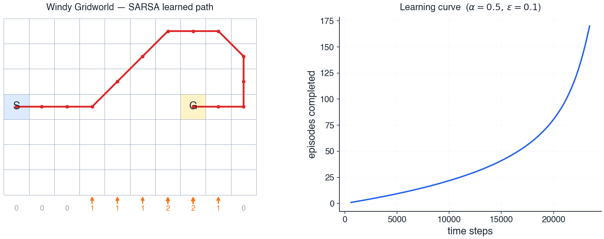{width="100%" fig-align="center"}

::: {.fragment}
SARSA with $\alpha = 0.5$, $\varepsilon = 0.1$ stabilises at $\sim 17$ steps; optimal is $15$ — the extra $2$ are the cost of exploration.
:::

::: notes
S&B Ex 6.5. 7×10 grid, wind blows agent up by 1–2 cells in middle columns.
SARSA with ε=0.1, α=0.5 finds shortest path (~17 steps; optimal is 15).
Figure: gridworld + learning curve. Generate via Python script later.
This is the "yes, the algorithm actually works" slide. Run it as a demo
if technical setup allows; otherwise show the static figure.
:::

## Teaser: Q-learning swaps one symbol

**SARSA:**
$$
Q(S, A) \;\leftarrow\; Q(S, A) + \alpha \,\Bigl[\, R + \gamma\, {\color{#2563eb}\mathbf{Q(S', A')}} - Q(S, A)\, \Bigr]
$$
*Target uses the action $\color{#f97316}A'$ that the agent will actually take.*

::: {.fragment}
**Q-learning:**
$$
Q(S, A) \;\leftarrow\; Q(S, A) + \alpha \,\Bigl[\, R + \gamma\, {\color{#dc2626}\mathbf{\max_{a'} Q(S', a')}} - Q(S, A)\, \Bigr]
$$
*Target uses the **best** possible next action — regardless of what the agent will do.*
:::

::: {.fragment .callout-important}
One symbol changed. Profoundly different behaviour. Why? Next slide.
:::

::: notes
Highlight the swap visually (bold + colour the second-line max). The
difference: SARSA's target is conditioned on the policy actually being
followed. Q-learning's target ignores the policy entirely — it bootstraps
off the OPTIMAL action.
SARSA = on-policy. Q-learning = off-policy. We don't unpack on/off-policy
here; the Cliff Walking slide makes the difference visceral.
:::

## SARSA vs Q-learning — the Cliff

Cliff on bottom row: stepping in gives $R = -100$ + reset. Every other step: $R = -1$.

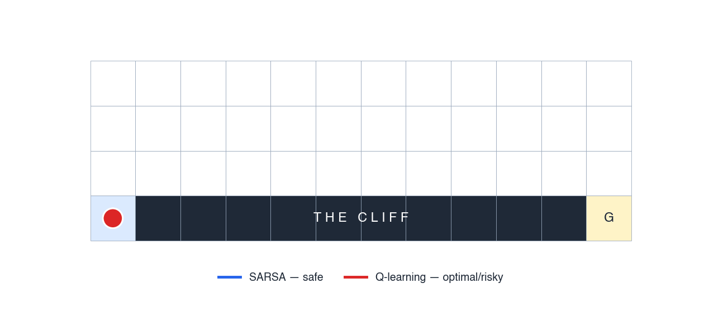{width="80%" fig-align="center"}

::: {.fragment .callout-tip title="The punchline"}
**SARSA** learns about the policy it's *actually following*.
**Q-learning** learns about the policy it *wishes* it could follow.
:::

::: notes
S&B Ex 6.6. The single best pedagogical example of on/off-policy difference.
Ask the class: "if you had to deploy one of these in a real warehouse where
the robot WILL occasionally slip, which would you pick?" Answer: SARSA's safer
behaviour is exactly what production systems usually want, even though the
expected return per episode is lower in the limit.
:::

## Exercise 3 — one SARSA update by hand

::: {.callout-note title="Pair work — 3 min"}
**Hyperparameters.** $\alpha = 0.1$, $\gamma = 0.9$.

**Q-table** (only what you need):

$$
Q(s_2, \mathrm{right}) = 5.0 \qquad Q(s_3, \mathrm{left}) = 2.0
$$

**One observed transition:**

$$
S = s_2,\; A = \mathrm{right},\; R = -1,\; S' = s_3,\; A' = \mathrm{left}
$$

**Compute the new $Q(s_2, \mathrm{right})$.**
:::

::: notes
Pair exercise (3 min). Standard one-step trace. Watch for: students using
max instead of A' (that would be Q-learning), forgetting the (1−α) on
the old Q estimate, dropping γ on the bootstrapped term.
:::

## Exercise 3 — solution

Plug into the SARSA update and simplify:
$$
\begin{aligned}
Q(s_2, \mathrm{right}) &\leftarrow\; Q(s_2, \mathrm{right}) + \alpha\, \bigl[\, R + \gamma\, Q(s_3, \mathrm{left}) - Q(s_2, \mathrm{right})\, \bigr] \\[2pt]
&=\; 5.0 + 0.1 \cdot [\, -1 + 0.9 \cdot 2.0 - 5.0\, ] \\[2pt]
&=\; 5.0 + 0.1 \cdot (-4.2)
\end{aligned}
$$

$$
\boxed{\;Q(s_2, \mathrm{right}) \;=\; 4.58\;}
$$

::: {.fragment .callout-warning title="Common errors"}
*(1)* Using $\max_{a'}$ — that's Q-learning. *(2)* Treating $Q(S,A)$ on the RHS as the just-updated value. *(3)* Reading $\gamma\, Q(s', a')$ as $\gamma + Q(s', a')$.
:::

::: notes
Walk through. Take 4 minutes. Common errors as listed.
End-of-block sanity check: every student should be able to do this update
in their head by the end of today.
:::

# Block 4 — Wrap {.section}

## From MDP to SARSA in one diagram

$$
\underbrace{\langle \mathcal{S}, \mathcal{A}, P, R, \gamma \rangle}_{\text{MDP}}
\;\xrightarrow{\;\text{policy value}\;}\;
q_\pi
\;\xrightarrow{\;P, R \text{ unknown}\;}\;
\underbrace{\text{sample} + \text{bootstrap}}_{\text{TD update}}
$$

$$
\xrightarrow{\;\text{must explore}\;}\;
\underbrace{\text{TD update} + \varepsilon\text{-greedy}}_{}
\;=\;
\boxed{\;\text{SARSA}\;}
$$

::: {.fragment .callout-tip}
We **defined** the problem (MDP) → **characterised** what we want ($q_\pi$ via Bellman) → **bypassed** the unknown model (sample + bootstrap) → **fixed** exploration ($\varepsilon$-greedy) → **arrived** at SARSA.
:::

::: notes
The lecture in one slide. Walk left-to-right with the class and ask them to
name each step. If they can name them all, the learning outcome is met.
:::

## What we did *not* cover

Named, not taught — for the curious:

:::: {.columns}
::: {.column width="48%"}
**Other tabular methods**

- Q-learning (beyond the teaser)
- Expected SARSA, $n$-step SARSA
- SARSA($\lambda$), eligibility traces
:::

::: {.column width="48%"}
**Beyond tabular RL**

- Function approximation, Deep RL
- Policy gradients
- Continuous actions, off-policy
:::
::::

**Where to read next:** Sutton & Barto (free PDF) · David Silver UCL · Stanford CS234.

::: {.fragment .callout-tip}
You now have the language to read and understand any of these.
:::

::: notes
Closing slide. Two-column layout, more compact. End with the empowering
line: today's lecture gives them the vocabulary to read further on their
own.
:::
